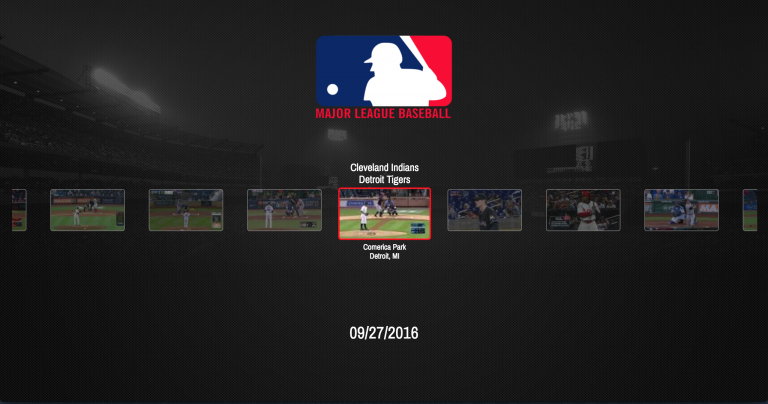

# MLB AM Take-Home Exercise

###Getting Started
  
  1. Install dependencies:

    `npm install`

  2. Start server:

    `npm start`

  3. Go to:

    `http://localhost:3000`

  4. Controls:

| Key         | Action         |
|-------------|----------------|
| Left Arrow  | Move Left      |   
| Right Arrow | Move Right     |
| Up Arrow    | Increase Date  |
| Down Arrow  | Decrease Date  |
| Enter       | Toggle Overlay |

###To Run Unit Tests

  `npm test`

###Technical Challenges
  1. **Focused Element**
  2. **Scroll To View** 
  3. **Date Object**
  4. **Image Errors**

###Technical Considerations
  1. **Debouncing**
  2. **Cache**
  3. **Concurrency**
  4. **Responsiveness**
  5. **Loading Spinner**

###Tech Stack

  - React
  - Redux
  - Redux-Thunk
  - Redux-Saga
  - ES2015
  - Node
  - Express
  - Babel
  - Webpack
  - Bootstrap
  - Jquery
  - Underscore